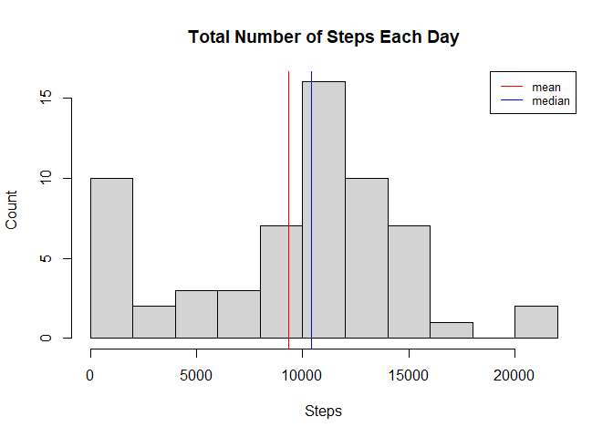
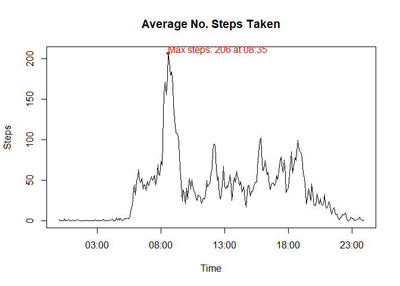
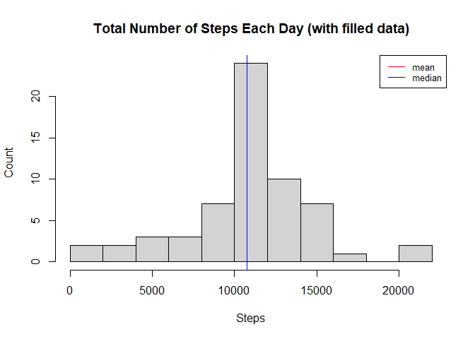
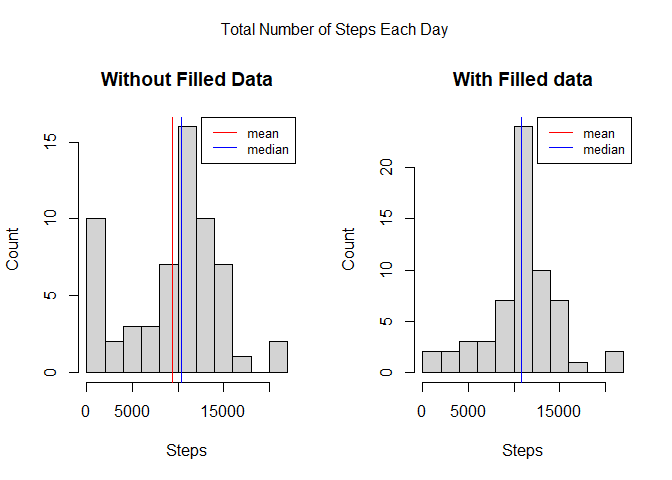

## Loading and preprocessing the data
Load libraries and data from source file:

```r
library(dplyr)
library(stringr)

unzip("./activity.zip")
activity <- read.csv("activity.csv")
```

Format date column:

```r
activity <- activity %>%
  mutate(date = as.POSIXct(strptime(date, "%Y-%m-%d")))
```

## What is mean total number of steps taken per day?
Total number of steps taken per day:

```r
dailytotal <- activity %>% 
  group_by(date) %>%
  summarize(steps = sum(steps, na.rm=TRUE))
```

Mean :

```r
mean(dailytotal$steps)
```

```
## [1] 9354.23
```

Median number of steps taken each day:

```r
median(dailytotal$steps)
```

```
## [1] 10395
```

Histogram of total number of steps taken each day:

```r
hist(dailytotal$steps, breaks=10, 
     main="Total Number of Steps Each Day", ylab="Count", xlab="Steps")
abline(v=mean(dailytotal$steps), col="red")
abline(v=median(dailytotal$steps), col="blue")
legend("topright", legend=c("mean", "median"), col=c("red", "blue"), lty=1, cex=0.8)
```

<!-- -->

## What is the average daily activity pattern?
Average number of steps taken across all days:

```r
intaverage <- activity %>%
  group_by(interval) %>%
  summarize(steps = mean(steps, na.rm=TRUE)) %>%
  mutate(time = as.POSIXct(strptime(str_pad(interval, width=4, side="left", pad="0"), "%H%M")))
```

The 5-minute interval that, on average, contains the maximum number of steps:

```r
maxint <- intaverage[which(intaverage$steps == max(intaverage$steps, na.rm=TRUE)),]
```


```
## # A tibble: 1 x 3
##   interval steps time               
##      <int> <dbl> <dttm>             
## 1      835  206. 2020-10-20 08:35:00
```

Time series plot of the average number of steps taken:

```r
with(intaverage, plot(time, steps, type="l", 
                      main="Average No. Steps Taken", ylab="Steps", xlab="Time"))
points(maxint$time, maxint$steps, pch=18, col="red")
text(maxint$time, maxint$steps + 1, 
     paste("Max steps:", round(maxint$steps), "at", format(maxint$time, "%H:%M")), 
     adj=c(0,0), col="red")
```

<!-- -->

## Imputing missing values
Total number of missing values in the dataset:

```r
sum(is.na(activity$steps))
```

```
## [1] 2304
```

Using the original dataset "activity", fill in all of the missing values with the average of the 5-minutes interval:

```r
actfill <- activity %>%
  mutate(steps = ifelse(is.na(steps), subset(intaverage, interval==interval)$steps, steps))
```

A new dataset for total number of steps taken per day with filled in value:

```r
dailyfilltotal <- actfill %>% 
  group_by(date) %>%
  summarize(steps = sum(steps, na.rm=TRUE))
```

Mean with filled in data:

```r
mean(dailyfilltotal$steps)
```

```
## [1] 10766.19
```

Median with filled in data:

```r
median(dailyfilltotal$steps)
```

```
## [1] 10766.19
```

Histogram of the total number of steps taken each day after missing values are imputed:

```r
hist(dailyfilltotal$steps, breaks=10, 
     main="Total Number of Steps Each Day (with filled data)", ylab="Count", xlab="Steps")
abline(v=mean(dailyfilltotal$steps), col="red")
abline(v=median(dailyfilltotal$steps), col="blue")
legend("topright", legend=c("mean", "median"), col=c("red", "blue"), lty=1, cex=0.8)
```

<!-- -->

Comparing with the first part of assignment:

```r
par(mfrow = c(1, 2), oma = c(0, 0, 2, 0))
hist(dailytotal$steps, breaks=10, main="Without Filled Data", ylab="Count", xlab="Steps")
abline(v=mean(dailytotal$steps), col="red")
abline(v=median(dailytotal$steps), col="blue")
legend("topright", legend=c("mean", "median"), col=c("red", "blue"), lty=1, cex=0.8)

hist(dailyfilltotal$steps, breaks=10, main="With Filled data", ylab="Count", xlab="Steps")
abline(v=mean(dailyfilltotal$steps), col="red")
abline(v=median(dailyfilltotal$steps), col="blue")
legend("topright", legend=c("mean", "median"), col=c("red", "blue"), lty=1, cex=0.8)
mtext("Total Number of Steps Each Day", outer = TRUE)
```

<!-- -->

Imputing missing data with average of the interval resulted in:

* Lower occurrences in 0 steps a day
* Higher occurrences in median
* Mean and median of daily steps taken are equal

## Are there differences in activity patterns between weekdays and weekends?
Create a new factor variable (weekday/weekend) in the dataset:

```r
actfilldow <- actfill %>%
  mutate(dow = ifelse(weekdays(date) %in% c("Saturday", "Sunday"), "weekend", "weekday" )) %>%
  group_by(interval, dow) %>%
  summarize(steps = mean(steps))
```

Panel plot comparing the average number of steps taken per 5-minute interval across weekdays and weekends:

```r
library(lattice)
xyplot(steps~interval | as.factor(dow), data = actfilldow, layout=c(1,2), type="l",
       xlab="Interval", ylab="Number of steps")
```

<!-- -->
